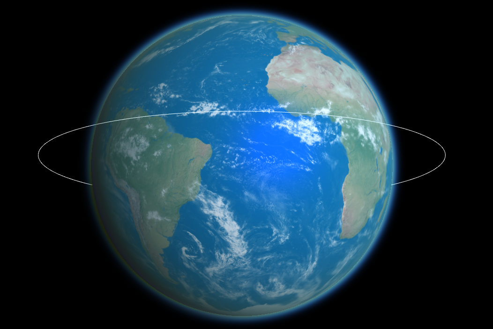
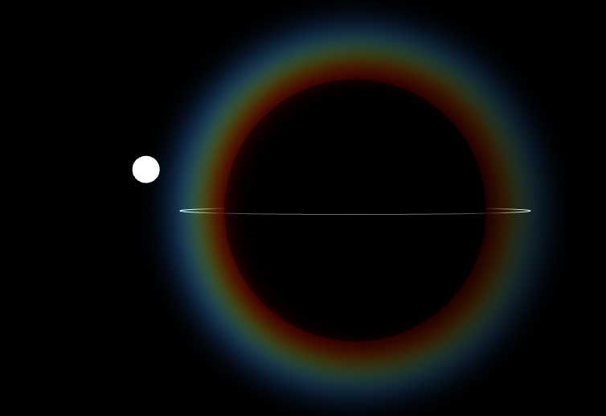

# Planet Rendering

Simple planet renderer in WebGL using Vue and ThreeJS. The atmosphere rendering is using simple density sampling.




## Setup and run the project
```
npm install
npm run serve
```
